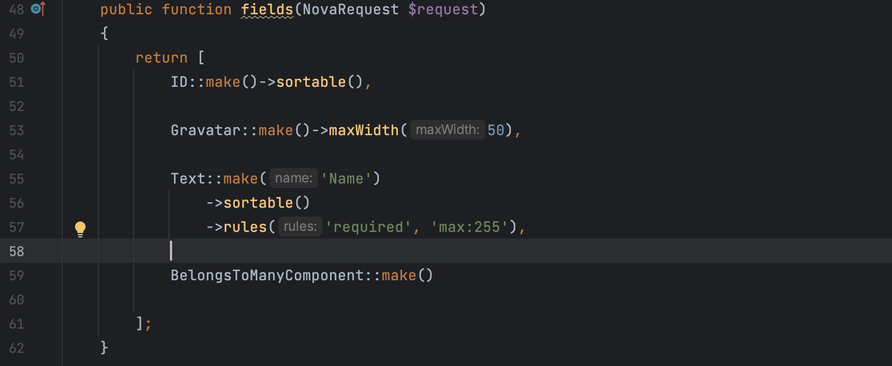
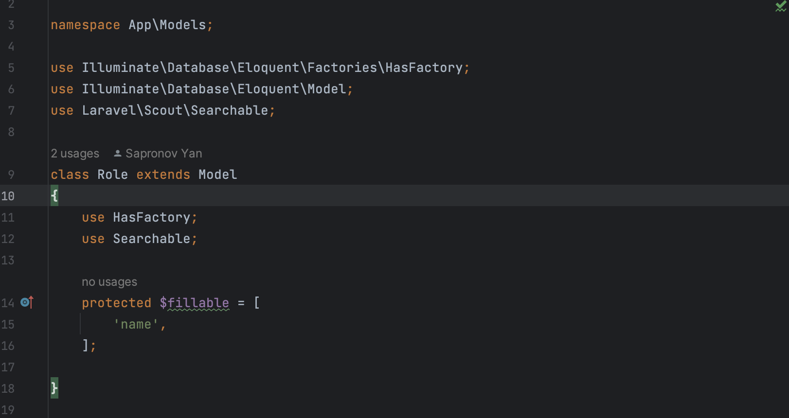

# BelongsToManyComponent

1. A component for interacting with many-through-many relationships through the admin panel

2. Create a pivot model with migration following the ModelaModelb convention
3. The foreign keys in the pivot model must be within the naming convention and correspond to the format modela_id and modelb_id
4. In order for the link search to work, it is necessary to hang the search trace from Laravel Scout in the subject model

